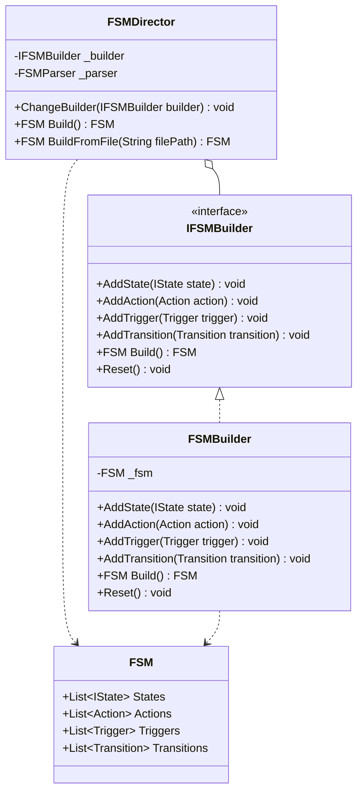
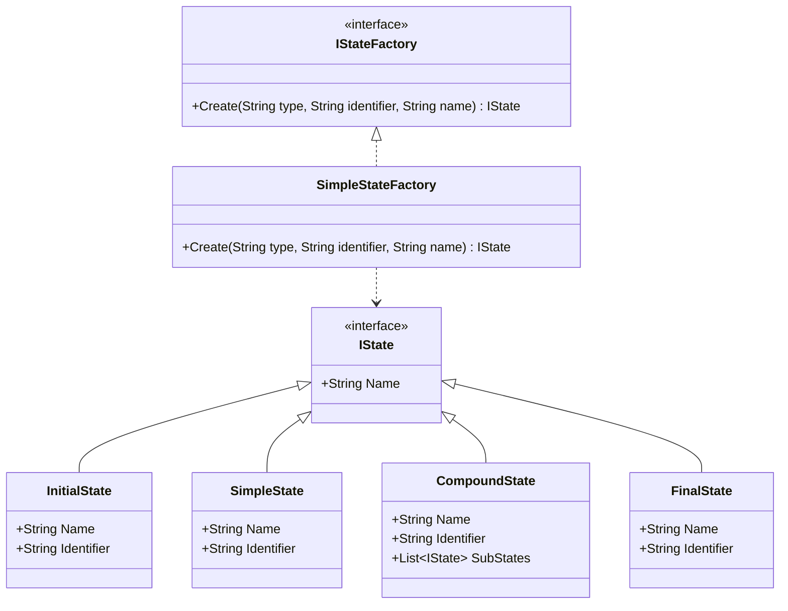
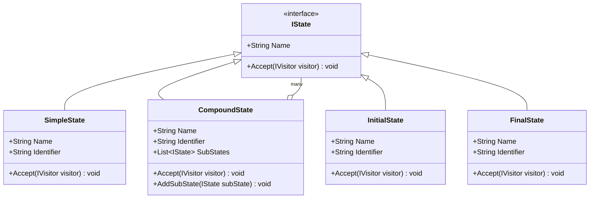
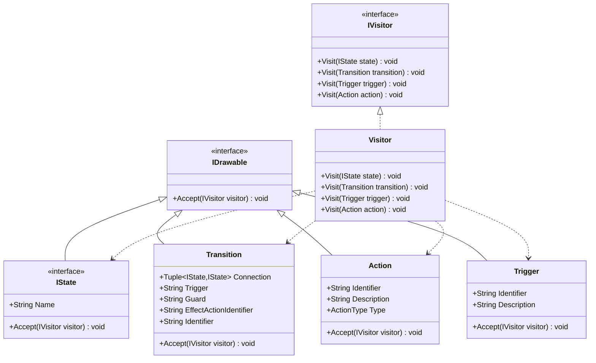
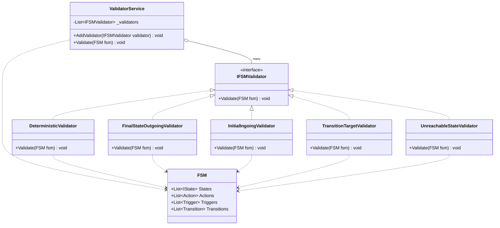

# Avans-DPAT-2425

| Naam         | Studentennummer |
| ------------ | --------------- |
| Bart Hol     | 2171763         |
| Roel Leijser | 2168562         |

## Rubric

| Criteria        | Score     |
| --------------- | --------- |
| Creatiepatronen | Goed      |
| Structuurpatronen | Goed |
| Gedragspatronen | Goed |
| Modulaire begrijpelijkheid Goede/consistente naamgevingen, code blocks doen slechts één ding. | Ruim voldoende |
| Modulaire compositie/decompositie Code blocks zijn onafhankelijk en herbruikbaar. | Goed |
| Kwaliteit - Code smells | Goed |
| Kwaliteit - Testing | Goed |
| Nice-to-have | NVT |

## Main Class Diagram

## Software Design Patterns

### 1. Builder Pattern

### 2. Factory Method Pattern

### 3. Composite Pattern

### 4. Visitor Pattern

### 5. Strategy Pattern

