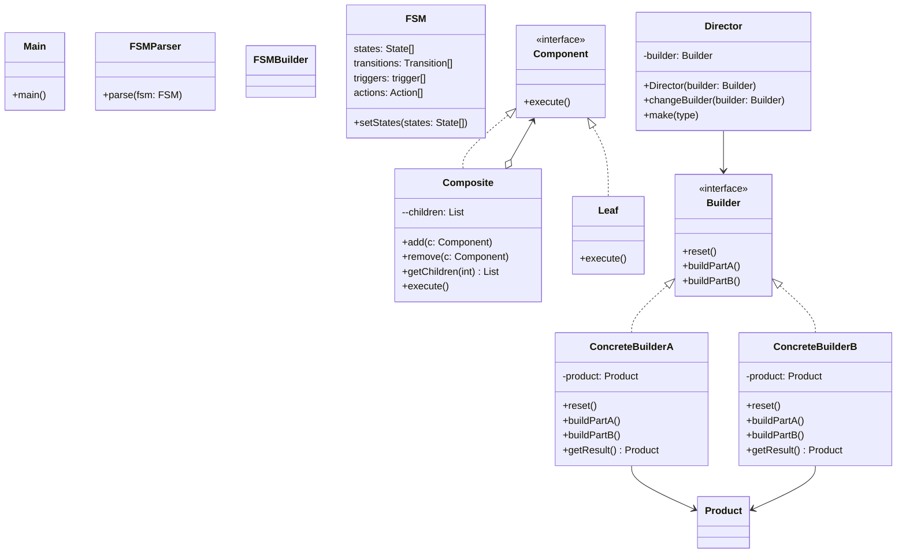

# Avans-DPAT-2425

| Naam         | Studentennummer |
| ------------ | --------------- |
| Bart Hol     | 2171763         |
| Roel Leijser | 2168562         |

```mermaid
    classDiagram
        class Main {
            +main()
        }

        class FSMParser {
            +parse(fsm: FSM)
        }

        class FSMBuilder {
            
        }

        class FSM {
            states: State[]
            transitions: Transition[]
            triggers: trigger[]
            actions: Action[]

            +setStates(states: State[])
        }

        class Component {
            <<interface>>
            +execute()
        }

        class Composite {
            --children: List<Component>
            +add(c: Component)
            +remove(c: Component)
            +getChildren(int) List<Component>
            +execute()
        }
        class Leaf {
            +execute()
        }

        class Director {
            -builder: Builder

            +Director(builder: Builder)
            +changeBuilder(builder: Builder)
            +make(type)
        }

        class Builder {
            <<interface>>
            +reset()
            +buildPartA()
            +buildPartB()
        }

        class ConcreteBuilderA {
            -product: Product
            +reset()
            +buildPartA()
            +buildPartB()
            +getResult() Product
        }

        class ConcreteBuilderB {
            -product: Product
            +reset()
            +buildPartA()
            +buildPartB()
            +getResult() Product
        }

        class Product 

        Component <|.. Leaf
        Component <|.. Composite
        Component <--o Composite
        Director --> Builder
        Builder <|.. ConcreteBuilderA
        Builder <|.. ConcreteBuilderB
        ConcreteBuilderA --> Product
        ConcreteBuilderB --> Product
```