# Avans-DPAT-2425

| Naam         | Studentennummer |
| ------------ | --------------- |
| Bart Hol     | 2171763         |
| Roel Leijser | 2168562         |

## Application Architecture

```mermaid
classDiagram
    class Program {
        +Main(args: string[])
    }

    class FileLoader {
        +Load(filePath: string): List~string~
    }

    class FSMDirector {
        -_builder: IFSMBuilder
        -_parser: FSMParser
        +ChangeBuilder(builder: IFSMBuilder)
        +Make(lines: List~string~): IFSMComponent
    }

    class FSMBuilder {
        -_fsm: FSM
        -_states: Dictionary~string, State~
        -_actions: Dictionary~string, Action~
        -_transitions: Dictionary~string, Transition~
        -_triggers: Dictionary~string, Trigger~
        +AddState(parsedState: ParsedState)
        +AddAction(parsedAction: ParsedAction)
        +AddTrigger(parsedTrigger: ParsedTrigger)
        +AddTransition(parsedTransition: ParsedTransition)
        +Build(): FSM
        +Reset()
    }

    class FSMParser {
        +ParseState(line: string): ParsedState
        +ParseAction(line: string): ParsedAction
        +ParseTrigger(line: string): ParsedTrigger
        +ParseTransition(line: string): ParsedTransition
    }

    class ValidatorService {
        -_validators: List~IFSMValidator~
        +AddValidator(validator: IFSMValidator)
        +Validate(fsm: FSM)
    }

    class DrawConsoleVisitor {
        -_outputLines: List~string~
        +OutputLines: IEnumerable~string~
        +Print(state: State)
        +Print(transition: Transition)
        +Print(trigger: Trigger)
        +Print(action: Action)
    }

    class ConsoleRenderer {
        +Render(lines: IEnumerable~string~)
    }

    class FSM {
        -_components: List~IFSMComponent~
        +Components: IEnumerable~IFSMComponent~
        +Add(component: IFSMComponent)
        +Remove(component: IFSMComponent)
        +Print(visitor: IVisitor)
    }

    class State {
        +Name: string
        +Type: StateType
        +Actions: List~Action~
        +Print(visitor: IVisitor)
    }

    class Transition {
        +SourceState: State
        +TargetState: State
        +Trigger: string
        +Action: Action
        +Guard: string
        +Print(visitor: IVisitor)
    }

    class Action {
        +Description: string
        +Type: ActionType
        +Print(visitor: IVisitor)
    }

    class Trigger {
        +Description: string
        +Print(visitor: IVisitor)
    }

    class StateFactory {
        +Create(type: string, name: string): IFSMComponent
    }

    %% Interfaces
    class IFSMComponent {
        <<interface>>
        +Print(visitor: IVisitor)
    }

    class IFSMBuilder {
        <<interface>>
        +AddState(parsedState: ParsedState)
        +AddAction(parsedAction: ParsedAction)
        +AddTrigger(parsedTrigger: ParsedTrigger)
        +AddTransition(parsedTransition: ParsedTransition)
        +Build(): FSM
        +Reset()
    }

    class IVisitor {
        <<interface>>
        +Print(state: State)
        +Print(transition: Transition)
        +Print(trigger: Trigger)
        +Print(action: Action)
    }

    class IFSMValidator {
        <<interface>>
        +Validate(fsm: FSM)
    }

    class IFSMComponentFactory {
        <<interface>>
        +Create(type: string, name: string): IFSMComponent
    }

    class ILoader {
        <<interface>>
        +Load(filePath: string): List~string~
    }

    class IRenderer {
        <<interface>>
        +Render(lines: IEnumerable~string~)
    }

    %% Relationships
    Program --> FileLoader
    Program --> FSMDirector
    Program --> ValidatorService
    Program --> DrawConsoleVisitor
    Program --> ConsoleRenderer

    FSMDirector --> IFSMBuilder
    FSMDirector --> FSMParser
    FSMBuilder ..|> IFSMBuilder
    FSMBuilder --> FSM

    ValidatorService --> IFSMValidator
    ValidatorService --> FSM

    FSM --> IFSMComponent
    State ..|> IFSMComponent
    Transition ..|> IFSMComponent
    Action ..|> IFSMComponent
    Trigger ..|> IFSMComponent

    DrawConsoleVisitor ..|> IVisitor
    FSM --> IVisitor
    State --> IVisitor
    Transition --> IVisitor
    Action --> IVisitor
    Trigger --> IVisitor

    StateFactory ..|> IFSMComponentFactory
    FileLoader ..|> ILoader
    ConsoleRenderer ..|> IRenderer
```

## Design Patterns

### 1. Builder Pattern

### 2. Abstract Factory Pattern (Low Binding)

### 3. Composite Pattern

### 4. Visitor Pattern

### 5. Strategy Pattern (Behavior Pattern)

